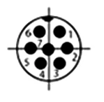

# Controller

## Connector & Protocol

Uses GX12 7pin connector with the same pinout/protocol as the SNES controller:

|  Line |  Port |
|-------|-------|
|   1   |  +5V  |
|   2   | Clock |
|   3   | Latch |
|   4   | Data  |
|   5   |  N/C  |
|   6   |  N/C  |
|   7   | Ground|
